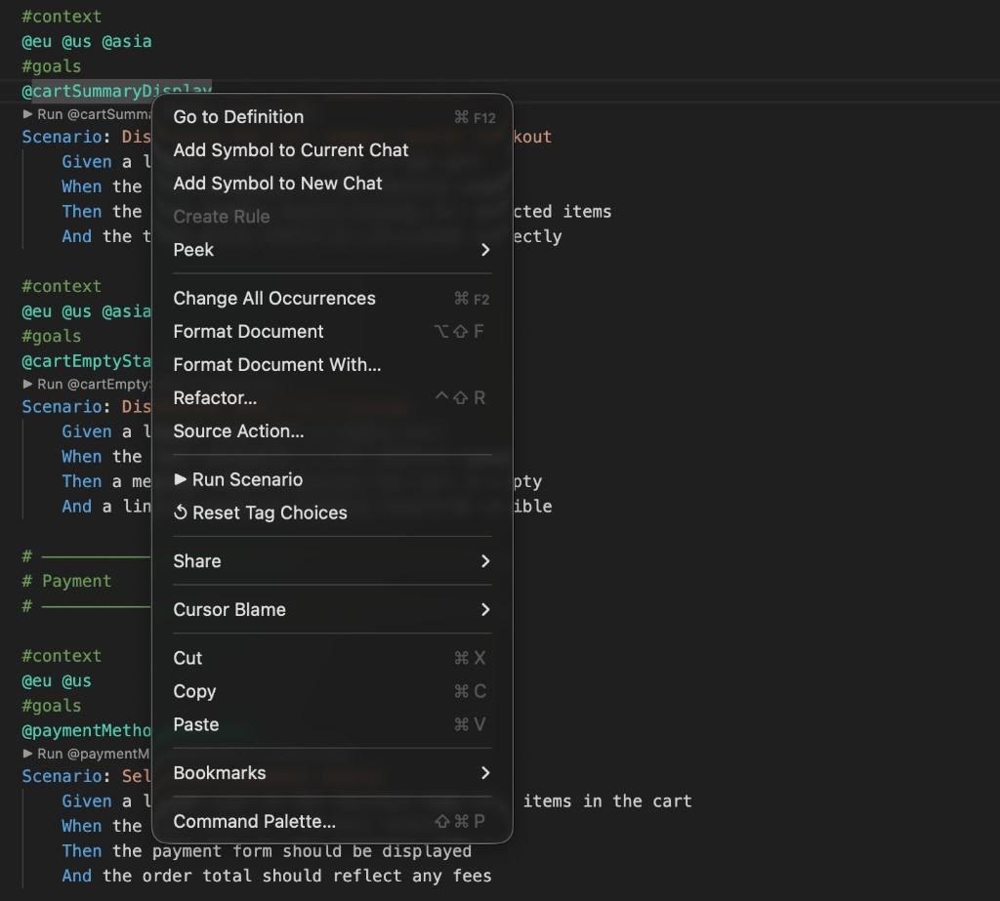
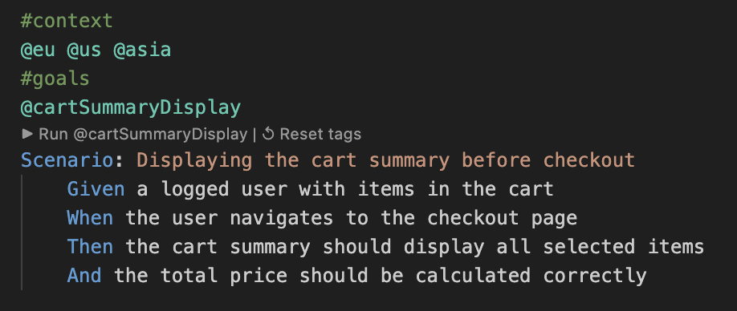

# Run Gherkin Scenario

Run any Gherkin scenario straight from VS Code or Cursor — right-click, click the inline button, or use a keyboard shortcut. The extension reads all tags (header and scenario-level), asks you to choose when a line has several values, remembers your picks, and builds the full CLI command for you.

## Features

- **Right-click context menu** — "Run Scenario" and "↺ Reset Tag Choices" appear when you right-click inside a `.feature` file
- **CodeLens inline buttons** — `▶ Run @tag` and `↺ Reset tags` appear above every `Scenario:` line
- **Automatic tag parsing** — reads both header tags (before `Feature:`) and scenario-level tags (above each `Scenario:`)
- **Multi-tag quickpick** — when a line has multiple tags (e.g. `@android @ios`), prompts you to choose one
- **Smart persistent choices** — the first scenario you run establishes file-level defaults; all other scenarios inherit them automatically without prompting
- **Per-scenario overrides** — reset a specific scenario to re-choose its tags independently from the file defaults
- **Configurable command** — works with any Gherkin CLI (Cucumber-JS, CodeceptJS, custom runners)
- **Configurable flags** — set default CLI flags per project

## Usage

### Right-click

Place your cursor anywhere inside a scenario and right-click:

- **▶ Run Scenario** — run the scenario at cursor position
- **▶ Run Scenario (visual)** — run with `--visual` flag (when enabled)
- **↺ Reset Tag Choices** — reset stored tag choices for the scenario at cursor position; if the cursor is outside any scenario, resets all choices for the file



### CodeLens

Each `Scenario:` line shows inline buttons:

- `▶ Run @goalTag` — run the scenario
- `▶ Run (visual)` — run with `--visual` flag (when enabled)
- `↺ Reset tags` — reset stored tag choices for this specific scenario



### Command Palette

`Cmd+Shift+P` (or `Ctrl+Shift+P`) and search for:

| Command | Description |
|---|---|
| **Run Scenario** | Run the scenario at the cursor position |
| **Run Scenario (visual)** | Run with `--visual` flag appended |
| **Gherkin: Configure Run Flags** | Pick or type default CLI flags |
| **↺ Reset Tag Choices** | Reset tag choices for the scenario at cursor (or whole file if outside a scenario) |

### Keyboard shortcut (optional)

Add this to your `keybindings.json`:

```json
{
  "key": "cmd+shift+t",
  "command": "workbench.action.tasks.runTask",
  "args": "Run Scenario",
  "when": "resourceExtname == .feature"
}
```

## How it works

Given a feature file like this:

```gherkin
@acme
@staging
@chrome @firefox
@en
Feature: Checkout

  #context
  @fr @com @sn
  #goals
  @checkoutGuestDisplay
  Scenario: Displaying the guest checkout form
    Given a user on the product page
    ...

  #context
  @fr @com @sn
  #goals
  @checkoutPayment
  Scenario: Processing the payment
    Given a user on the checkout page
    ...
```

When you run the first scenario:

1. The extension collects **header tags**: `@acme`, `@staging`, `@chrome @firefox`, `@en`
2. It collects **scenario-level tags**: `@fr @com @sn` (above the `Scenario:`, skipping `#comments`)
3. For multi-tag lines (`@chrome @firefox`, `@fr @com @sn`) it shows a quickpick
4. These choices become the **file-level defaults** — saved for next time
5. It extracts the **goal tag** `@checkoutGuestDisplay` from the line above `Scenario:`
6. It builds and runs: `npx cucumber-js @acme @staging @chrome @en @fr @checkoutGuestDisplay`

When you run the second scenario, it **inherits the file defaults** — no prompts.

To override choices for a specific scenario, click `↺ Reset tags` (or right-click > "↺ Reset Tag Choices"). On the next run of that scenario, you'll be prompted again, and the new choice is stored as a **per-scenario override** without affecting other scenarios.

## Configuration

All settings live under `gherkinRunner.*` and can be set per-workspace in `.vscode/settings.json`.

| Setting | Type | Default | Description |
|---|---|---|---|
| `gherkinRunner.runCommand` | `string` | `"npx cucumber-js"` | Base command to run scenarios |
| `gherkinRunner.stripTagPrefix` | `boolean` | `false` | Strip `@` from tags before passing to the CLI |
| `gherkinRunner.defaultFlags` | `string[]` | `[]` | Flags appended to every run |
| `gherkinRunner.availableFlags` | `object[]` | `[]` | Flags shown in the "Configure Run Flags" picker (see below) |
| `gherkinRunner.showCodeLens` | `boolean` | `true` | Show inline Run buttons above each Scenario |
| `gherkinRunner.showVisualCodeLens` | `boolean` | `false` | Show an additional Run (visual) CodeLens button |

### Example: CodeceptJS project

```json
{
  "gherkinRunner.runCommand": "yarn cjs",
  "gherkinRunner.stripTagPrefix": true,
  "gherkinRunner.defaultFlags": ["-v"],
  "gherkinRunner.availableFlags": [
    { "flag": "-v", "label": "Verbose output" },
    { "flag": "-d", "label": "Debug mode" },
    { "flag": "-s", "label": "Interactive step-by-step debug" },
    { "flag": "-D", "label": "Show browser (Playwright)" },
    { "flag": "-l", "label": "Local device testing" },
    { "flag": "--visual", "label": "Visual regression (Pixelmatch)" },
    { "flag": "-e", "label": "Export results to test referential" }
  ]
}
```

### Example: Cucumber-JS project

```json
{
  "gherkinRunner.runCommand": "npx cucumber-js",
  "gherkinRunner.defaultFlags": ["--format", "progress"]
}
```

### Example: Custom npm script

```json
{
  "gherkinRunner.runCommand": "npm test --",
  "gherkinRunner.defaultFlags": ["--bail"]
}
```

## Installation

### From the Marketplace

Search for **"Run Gherkin Scenario"** in the Extensions view (`Cmd+Shift+X`).

### From VSIX

Download the `.vsix` file from the [GitHub Releases](https://github.com/raoulfesquet/vscode-run-gherkin-scenario/releases) page, then:

```bash
code --install-extension run-gherkin-scenario-1.0.0.vsix
```

For Cursor:

```bash
/Applications/Cursor.app/Contents/Resources/app/bin/cursor --install-extension run-gherkin-scenario-1.0.0.vsix
```

## License

[MIT](LICENSE)
